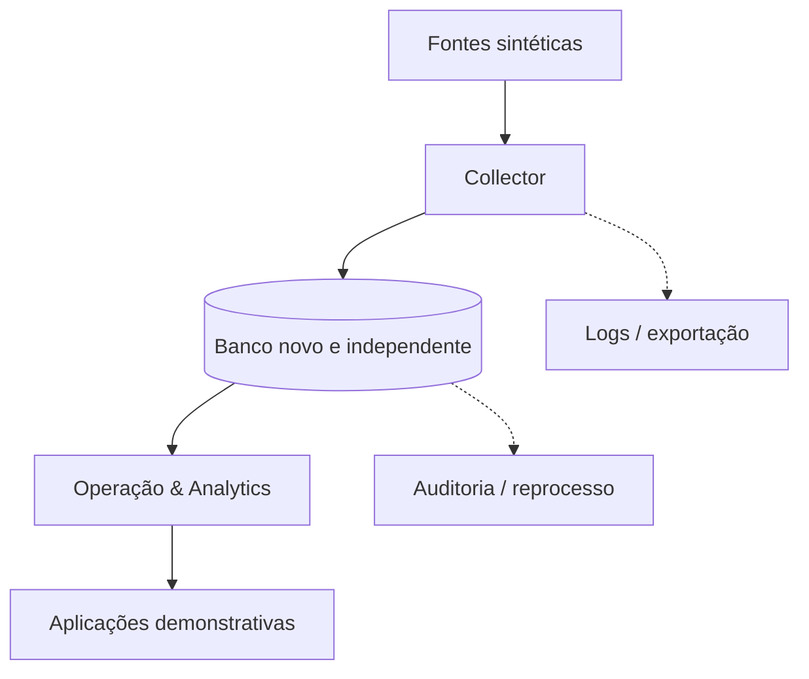

# PIO — Plataforma Inteligente Operacional

> Arquitetura demonstrativa para transformar dados operacionais sintéticos em informação rastreável, indicadores e apoio à decisão.

A **PIO — Plataforma Inteligente Operacional** é um ecossistema modular de software aplicado à automação, manutenção e dados industriais.

Este repositório apresenta a visão arquitetural da plataforma e integra demonstrações independentes construídas exclusivamente com cenários e dados sintéticos.

> **Segurança:** este portfólio não contém credenciais, endereços de rede, tags proprietárias, programas de PLC, bancos corporativos, telas de supervisório ou dados reais de produção. As demonstrações públicas não escrevem em equipamentos industriais.

---

## Visão em 30 segundos

A arquitetura separa a aquisição dos dados de seu uso operacional:

**FONTES SINTÉTICAS → COLLECTOR → OPERAÇÃO & ANALYTICS → APLICAÇÕES**

| Componente | Responsabilidade |
|---|---|
| **Fontes sintéticas** | Produzir sinais e cenários industriais reproduzíveis para demonstração e testes |
| **Collector** | Coletar, validar, registrar qualidade, persistir e disponibilizar dados de forma independente |
| **Operação & Analytics** | Aplicar regras, reconstruir eventos, calcular indicadores e gerar diagnósticos |
| **Aplicações** | Apresentar dashboards, análises, relatórios e alertas aos usuários |

Essa separação reduz acoplamento, facilita testes e permite que novas aplicações consumam dados confiáveis sem alterar o processo de coleta.

---

## Problema tratado

Em operações industriais, sinais de máquinas e registros de produção frequentemente existem de forma isolada. Sem contexto, qualidade e rastreabilidade, eles não se transformam automaticamente em conhecimento operacional.

A PIO explora uma abordagem estruturada para:

- preservar a origem e a qualidade dos dados;
- separar coleta, interpretação e apresentação;
- reconstruir eventos operacionais de maneira auditável;
- calcular indicadores com regras explícitas;
- apoiar diagnóstico, recorrência e priorização;
- permitir evolução incremental de novos módulos.

---

## Arquitetura conceitual



### 1. Collector

Responsável pelo ciclo de vida da coleta, sem depender de dashboards ou regras específicas de uma aplicação.

Capacidades arquiteturais previstas:

- configuração de fontes, sinais e período de aquisição;
- validação individual das fontes antes da aprovação;
- registro de data, hora, qualidade e origem;
- persistência em banco independente;
- logs operacionais e checkpoints;
- recuperação segura após interrupções;
- backup e exportação;
- suporte a reprocessamento controlado.

### 2. Operação & Analytics

Consome os dados persistidos pelo Collector e acrescenta significado operacional.

Responsabilidades:

- regras de negócio versionadas;
- critérios de validade e inconclusividade;
- reconstrução de eventos;
- cálculo de tempo perdido e indicadores;
- análises por período, equipamento ou entidade;
- histórico, recorrência e diagnóstico;
- fornecimento de dados para dashboards e relatórios.

### 3. Aplicações

São consumidores independentes da arquitetura. Cada aplicação resolve um problema específico sem assumir a responsabilidade pela coleta bruta.

---

## Aplicações demonstrativas

### Industrial Microstop Monitor

Protótipo para identificação e análise de microparadas em um cenário industrial genérico.

Principais capacidades demonstradas:

- detecção estruturada de eventos;
- critérios explícitos de validade;
- tratamento da qualidade dos dados;
- cálculo de tempo perdido;
- persistência de eventos;
- histórico e recorrência;
- visualização operacional.

**Fluxo:**

`Sinais sintéticos → Coleta → Regras operacionais → Evento válido → Tempo perdido → Análise`

### Industrial Hourly Production Dashboard

Protótipo para acompanhamento de desempenho produtivo por hora.

Principais capacidades demonstradas:

- produção e meta por hora;
- acumulado fechado e acumulado atual;
- meta proporcional;
- resultado e eficiência;
- identificação da hora atual e da última hora fechada;
- dashboard operacional.

**Fluxo:**

`Dados horários sintéticos → Coleta → Contextualização temporal → Indicadores → Dashboard`

> Esses projetos são casos de aplicação da arquitetura, não os limites funcionais da PIO.

---

## Princípios de engenharia

- **Somente dados sintéticos no portfólio público**;
- **somente leitura como referência para integrações industriais futuras**;
- **banco novo e arquitetura limpa para cada nova geração relevante**;
- **históricos legados utilizados apenas em análise forense e testes offline, quando aplicável**;
- **separação entre dado bruto, evento interpretado e indicador**;
- **mudanças incrementais, reversíveis e auditáveis**;
- **regras explícitas e verificáveis por testes**;
- **falhas de qualidade nunca tratadas silenciosamente como condição normal**;
- **simplicidade operacional antes de complexidade desnecessária**.

---

## Estrutura do repositório

```text
.
├── .github/          # automações e governança do repositório
├── docs/             # documentação arquitetural e executiva
├── scripts/          # utilitários de validação e demonstração
├── tests/            # verificações automatizadas
├── .env.example      # exemplo seguro de configuração
├── CHANGELOG.md      # histórico de mudanças
├── CONTRIBUTING.md   # diretrizes de contribuição
├── README.md         # visão principal do projeto
└── SECURITY.md       # política de segurança
```

---

## Estado atual

| Entrega | Situação |
|---|---|
| Arquitetura conceitual | Disponível |
| Documentação executiva | Disponível |
| Cenários com dados sintéticos | Em evolução |
| Industrial Microstop Monitor | Protótipo demonstrativo independente |
| Industrial Hourly Production Dashboard | Protótipo demonstrativo independente |
| Collector independente | Próxima geração em desenvolvimento |
| Operação & Analytics | Planejada sobre o novo contrato de dados |
| Integração com ambiente industrial real | Fora do escopo público |

Os status acima distinguem claramente arquitetura, protótipo e capacidade implementada. Itens planejados não devem ser interpretados como funcionalidades concluídas.

---

## Validação

Antes de qualquer publicação ou release, o projeto deve passar por:

1. testes automatizados;
2. verificação das automações do repositório;
3. revisão de segredos e informações sensíveis;
4. inspeção dos exemplos e dados sintéticos;
5. revisão da documentação e dos links;
6. validação de que nenhuma dependência industrial real foi incluída.

---

## Roadmap

- [x] Definir a arquitetura conceitual do ecossistema;
- [x] estruturar governança, documentação e testes iniciais;
- [x] separar aplicações demonstrativas por problema operacional;
- [ ] consolidar o contrato de dados do Collector;
- [ ] implementar coleta sintética independente;
- [ ] validar checkpoint, recuperação, backup e exportação;
- [ ] implementar a camada Operação & Analytics;
- [ ] publicar demonstrações reproduzíveis;
- [ ] criar a primeira release pública após o Gate de Publicação.

---

## Escopo público

Este projeto é um portfólio técnico e educacional baseado em problemas industriais genéricos. Ele demonstra decisões de arquitetura e engenharia sem reproduzir infraestrutura, lógica, dados ou propriedade intelectual de qualquer empresa ou planta real.

## English summary

PIO is a modular industrial intelligence architecture that separates synthetic data acquisition, operational analytics and user-facing applications. This public portfolio uses generic scenarios and synthetic data only, with an emphasis on traceability, data quality, testability and secure engineering practices.

---

**Status:** publicação inicial concluída após aprovação do Gate de Publicação.
